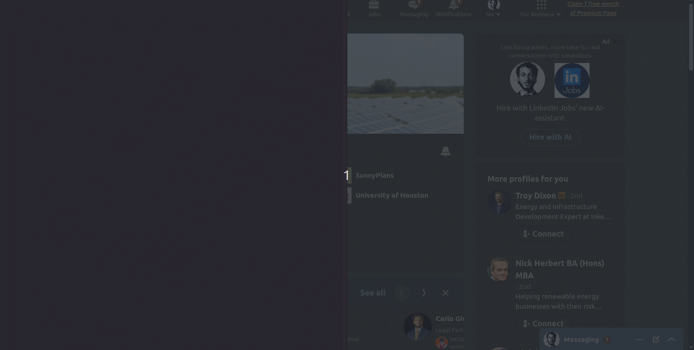

> **Describe your product. Define your target market. The AI finds the leads for you.**

<div align="center">

[](https://github.com/eracle/OpenOutreach/stargazers)
[](https://github.com/eracle/OpenOutreach/network/members)
[](https://www.gnu.org/licenses/gpl-3.0)
[](https://github.com/eracle/OpenOutreach/issues)

<br/>

# Demo:



</div>

---

### 🚀 What is OpenOutreach?

OpenOutreach is a **self-hosted, open-source LinkedIn automation tool** for B2B lead generation. Unlike other tools, **you don't need a list of profiles to contact** — you describe your product and your target market, and the system autonomously discovers, qualifies, and contacts the right people.

**How it works:**

1. **You provide** a product description and a campaign objective (e.g. "SaaS analytics platform" targeting "VP of Engineering at Series B startups")
2. **The AI generates** LinkedIn search queries to discover candidate profiles
3. **A Bayesian ML model** (Gaussian Process on profile embeddings) learns which profiles match your ideal customer — using an explore/exploit strategy to balance finding the best leads now vs. learning what makes a good lead
4. **Early on**, an LLM classifies each profile; **as the model learns**, it auto-decides with increasing confidence, reducing LLM calls
5. **Qualified leads** are automatically contacted with personalized connection requests and follow-up messages

The system gets smarter with every decision. It starts by exploring broadly, then progressively focuses on the highest-value profiles as it learns your ideal customer profile from its own classification history.

**Why choose OpenOutreach?**

- 🧠 **Autonomous lead discovery** — No contact lists needed; AI finds your ideal customers
- 🛡️ **Undetectable** — Playwright + stealth plugins mimic real user behavior
- 💾 **Self-hosted + full data ownership** — Everything runs locally, browse your CRM in a web UI
- 🐳 **One-command setup** — Dockerized deployment, interactive onboarding
- ✨ **AI-powered messaging** — LLM-generated personalized outreach (bring your own model)

Perfect for founders, sales teams, and agencies who want powerful automation **without account bans or subscription lock-in**.

---

## 📋 What You Need

| # | What | Example |
|---|------|---------|
| 1 | **A LinkedIn account** | Your email + password |
| 2 | **An LLM API key** | OpenAI, Anthropic, or any OpenAI-compatible endpoint |
| 3 | **A product description + target market** | "We sell cloud cost optimization for DevOps teams at mid-market SaaS companies" |

That's it. No spreadsheets, no lead databases, no scraping setup.

---

## ⚡ Quick Start (Docker — Recommended)

Pre-built images are published to GitHub Container Registry on every push to `master`.

```bash
docker run --pull always -it -p 5900:5900 --user "$(id -u):$(id -g)" -v ./assets:/app/assets ghcr.io/eracle/openoutreach:latest
```

The interactive onboarding walks you through the three inputs above on first run. Your data persists in the local `assets/` directory across restarts — the same database used by `python manage.py`.

Connect a VNC client to `localhost:5900` to watch the browser live.

For Docker Compose, build-from-source, and more options see the **[Docker Guide](./docs/docker.md)**.

---

## ⚙️ Local Installation (Development)

For contributors or if you prefer running directly on your machine.

### Prerequisites

- [Git](https://git-scm.com/)
- [Python](https://www.python.org/downloads/) (3.12+)

### 1. Clone & Set Up
```bash
git clone https://github.com/eracle/OpenOutreach.git
cd OpenOutreach

# Install deps, Playwright browsers, run migrations, and bootstrap CRM
make setup
```

### 2. Run the Daemon

```bash
make run
```
The interactive onboarding will prompt for LinkedIn credentials, LLM API key, and campaign details on first run. Fully resumable — stop/restart anytime without losing progress.

### 3. View Your Data (CRM Admin)

OpenOutreach includes a full CRM web interface powered by DjangoCRM:
```bash
# Create an admin account (first time only)
python manage.py createsuperuser

# Start the web server
make admin
```
Then open:
- **Django Admin:** http://localhost:8000/admin/
- **CRM UI:** http://localhost:8000/crm/

---
## ✨ Features

| Feature                            | Description                                                                                                          |
|------------------------------------|----------------------------------------------------------------------------------------------------------------------|
| 🧠 **Autonomous Lead Discovery**   | No contact lists needed — LLM generates search queries from your product description and campaign objective.         |
| 🎯 **Bayesian Active Learning**    | Gaussian Process model on profile embeddings learns your ideal customer via explore/exploit, auto-qualifying with increasing accuracy. |
| 🤖 **Stealth Browser Automation**  | Playwright + stealth plugins mimic real user behavior for undetectable interactions.                                 |
| 🛡️ **Voyager API Scraping**       | Uses LinkedIn's internal API for accurate, structured profile data (no fragile HTML parsing).                        |
| 🔄 **Stateful Pipeline**          | Tracks profile states (`NEW` → `PENDING` → `CONNECTED` → `COMPLETED`) in a local DB — fully resumable.             |
| ⏱️ **Smart Rate Limiting**        | Configurable daily/weekly limits per action type, respects LinkedIn's own limits automatically.                      |
| 💾 **Built-in CRM**               | Full data ownership via DjangoCRM with Django Admin UI — browse Leads, Contacts, Companies, and Deals.              |
| 🐳 **One-Command Deployment**      | Dockerized setup with interactive onboarding and VNC browser view (`localhost:5900`).                                |
| ✍️ **AI-Powered Messaging**        | LLM-generated personalized connection and follow-up messages via Jinja2 templates.                                  |

---

## 📖 How the ML Pipeline Works

The daemon runs a continuous loop with priority-scheduled action lanes:

| Priority | Lane | What it does |
|----------|------|-------------|
| 1 | **Connect** | Ranks qualified profiles by Bayesian model probability, sends connection requests (daily + weekly limits) |
| 2 | **Check Pending** | Checks if pending requests were accepted (exponential backoff) |
| 3 | **Follow Up** | Sends LLM-personalized messages to connected profiles (daily limit) |
| Gap-filler | **Qualify** | Bayesian active learning — embeds profiles, then explore/exploit to select and classify candidates |
| Lowest | **Search** | LLM-generated LinkedIn People search keywords discover new profiles when the pipeline runs low |

**The qualification loop in detail:**

Profiles discovered during navigation are automatically scraped and embedded (384-dim FastEmbed vectors). The **Qualify** lane then decides which profile to evaluate next using a balance-driven strategy:

- **When negatives outnumber positives** → **exploit**: pick the profile with highest predicted qualification probability (seek likely positives to fill the pipeline)
- **Otherwise** → **explore**: pick the profile with highest BALD (Bayesian Active Learning by Disagreement) score (seek the most informative label to improve the model)

For each selected profile, the Gaussian Process model checks if it's confident enough to auto-decide (low entropy + low posterior uncertainty). If confident, it qualifies or disqualifies automatically. If uncertain, it falls back to an LLM call. Every decision — human or auto — feeds back into the model, making it progressively smarter.

**Cold start:** With fewer than 2 labelled profiles, the model can't fit — all decisions go through the LLM. As labels accumulate, the GP auto-decides more profiles, reducing LLM calls over time.

**Cost curve:** The system gets cheaper to run the longer it operates. Early on, every profile requires an LLM call (~100% LLM usage). As the Gaussian Process learns your preferences, it auto-decides with high confidence on an increasing share of profiles — the LLM is only queried for genuinely uncertain cases. A mature model can auto-decide the majority of profiles, cutting LLM costs dramatically.

Configure rate limits and behavior via Django Admin (LinkedInProfile + Campaign models).

---

## 📂 Project Structure

```
├── assets/
│   ├── data/                        # crm.db (SQLite), analytics.duckdb (embeddings)
│   └── models/                      # Persisted ML model (model.joblib)
├── docs/
│   ├── architecture.md              # System architecture
│   ├── configuration.md             # Configuration reference
│   ├── docker.md                    # Docker setup guide
│   ├── templating.md                # Message template guide
│   └── testing.md                   # Testing strategy
├── linkedin/
│   ├── actions/                     # Browser actions (connect, message, scrape)
│   ├── api/                         # Voyager API client + parser
│   ├── conf.py                      # Configuration loading (.env + defaults)
│   ├── daemon.py                    # Main daemon loop (priority-scheduled lanes)
│   ├── db/crm_profiles.py           # CRM-backed profile CRUD (Lead, Contact, Company, Deal)
│   ├── django_settings.py           # Django/CRM settings (SQLite at assets/data/crm.db)
│   ├── lanes/                       # Action lanes (qualify, connect, check_pending, follow_up, search)
│   ├── management/setup_crm.py      # Idempotent CRM bootstrap (Dept, Stages, Users)
│   ├── ml/                          # Bayesian qualifier, DuckDB embeddings, profile text, search keywords
│   ├── navigation/                  # Login, throttling, browser utilities, enums
│   ├── onboarding.py                # Interactive onboarding (campaign, credentials, LLM config)
│   ├── gdpr.py                      # GDPR location detection for newsletter
│   ├── rate_limiter.py              # Daily/weekly rate limiting
│   ├── sessions/                    # Session management (AccountSession)
│   └── templates/                   # Message rendering (Jinja2 / AI-prompt)
├── manage.py                         # Entry point (no args = daemon, or Django commands)
├── local.yml                        # Docker Compose
└── Makefile                         # Shortcuts (setup, run, admin, analytics, test)
```

---

## 📚 Documentation

- [Architecture](./docs/architecture.md)
- [Configuration](./docs/configuration.md)
- [Docker Installation](./docs/docker.md)
- [Templating](./docs/templating.md)
- [Template Variables](./docs/template-variables.md)
- [Testing](./docs/testing.md)

---

## 💬 Community

Join for support and discussions:
[Telegram Group](https://t.me/+Y5bh9Vg8UVg5ODU0)

---

### 🗓️ Book a Free 15-Minute Call

Got a specific use case, feature request, or questions about setup?

Book a **free 15-minute call** — I'd love to hear your needs and improve the tool based on real feedback.

<div align="center">

[](https://calendly.com/eracle/new-meeting)

</div>

---

### ❤️ Support OpenOutreach

This project is built in spare time to provide powerful, **free** open-source growth tools. Your sponsorship funds faster updates and keeps it free for everyone.

<div align="center">

[](https://github.com/sponsors/eracle)

<br/>

| Tier        | Monthly | Benefits                                                              |
|-------------|---------|-----------------------------------------------------------------------|
| ☕ Supporter | $5      | Huge thanks + name in README supporters list                          |
| 🚀 Booster  | $25     | All above + priority feature requests + early access to new campaigns |
| 🦸 Hero     | $100    | All above + personal 1-on-1 support + influence roadmap               |
| 💎 Legend   | $500+   | All above + custom feature development + shoutout in releases         |

</div>

---

## ⚖️ License

[GNU GPLv3](https://www.gnu.org/licenses/gpl-3.0) — see [LICENCE.md](LICENCE.md)

---

## 📜 Legal Notice

**Not affiliated with LinkedIn.**

By using this software you accept the [Legal Notice](LEGAL_NOTICE.md). It covers LinkedIn ToS risks, built-in self-promotional actions, automatic newsletter subscription for non-GDPR accounts, and liability disclaimers.

**Use at your own risk — no liability assumed.**

---

<div align="center">

**Made with ❤️**

</div>
